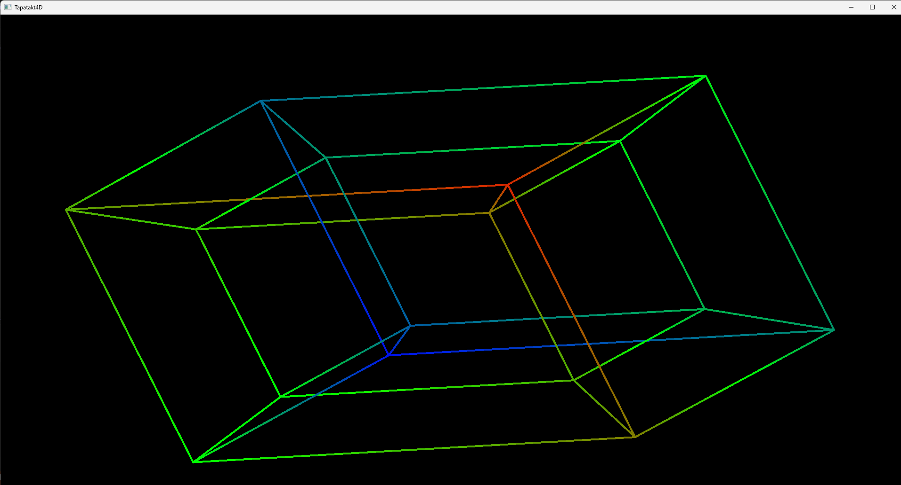

# Tapatakt4D

A C# library for rendering 4D wireframe geometry using **color as the 3rd screen dimension**.



## The Idea

In 4D graphics, we have 4 spatial dimensions but only 2D screens. This library uses:
- **X, Y** → Screen position (with perspective projection)
- **Z** → Depth (standard 3D perspective)
- **W** → **Color** (red for +W "ana", blue for -W "kata", green for W=0)

When multiple edges overlap on the same pixel, they alternate each frame (frame % count).

## Features

- 🎮 **GPU-accelerated** rendering with OpenGL 4.3+
- 🧊 **4D shapes**: Tesseract (hypercube), and extensible shape system
- 🎨 **Color-coded depth**: Instantly see the 4th dimension
- 🎥 **4D camera**: Full 6-plane rotation (XY, XZ, XW, YZ, YW, ZW)
- ⚡ **Tiled rasterization**: Efficient edge rendering

## Quick Start

```csharp
using Tapatakt4D;
using Tapatakt4D.Examples;

// Create a scene with a rotating tesseract
TesseractScene scene = new(
    rotationSpeed: 1.0f,
    tesseractSize: 1.0f
);

// Setup camera
camera = new Camera(
    position: new Vector4(0, 0, 8, 0),  // 8 units back
    projectionDistance: 2.0f
);

// Render
using WireRenderer renderer = new(1280, 720);
List<Edge4D> edges = scene.GetEdges();
renderer.Render(edges, camera.RotationInverse, camera.Position, camera.ProjectionDistance);
```

See `Examples/TesseractScene.cs` for a complete demo with controls.

## Installation

```bash
dotnet add package Tapatakt4D  # When published
```

Or clone and reference the project:

```bash
git clone https://github.com/yourusername/Tapatakt4D.git
cd Tapatakt4D
dotnet build
```

## Creating Custom Shapes

```csharp
public class GlomeWireframe : Shape4D
{
    public GlomeWireframe(Vector4 origin, float radius) : base(origin)
    {
        // Create edges...
        for (int i = 0; i < segments; i++)
        {
            // Add edges to Children list
            Children.Add(new Edge4D(start, end, thickness: 1.0f));
        }
    }
}
```

## How It Works

### Rendering Pipeline

1. **Compute Shader** projects edges from 4D world space to 2D screen
2. **Tiling** assigns edges to screen regions for efficiency
3. **Fragment Shader** renders each pixel:
   - Finds all edges covering the pixel
   - Applies perspective-correct W clipping
   - Alternates edges by frame number
   - Maps W coordinate to red/green/blue

### The W Dimension

- **Ana** (+W): Maximum red `(255, 0, 0)`
- **Center** (W=0): Green `(0, 255, 0)`
- **Kata** (-W): Maximum blue `(0, 0, 255)`

Visible W range grows with distance (perspective-correct): `|w| < distance * 0.25`

## Demo Controls

The included `DemoEnv` provides:

| Input | Action |
|-------|--------|
| **W/S** | Move forward/back (Z) |
| **A/D** | Move left/right (X) |
| **Shift/Ctrl** | Move up/down (Y) |
| **Z/X** | Move ana/kata (W) |
| **Mouse X/Y** | Yaw/Pitch |
| **Q/E** | Roll (XY) |
| **Wheel** | ZW rotation |
| **LMB/RMB** | XW rotation (±) |
| **1/3** | YW rotation (±) |
| **Esc** | Exit |

## Requirements

- .NET 10.0+
- OpenGL 4.3+ capable GPU
- OpenTK 4.9.3

## Project Structure

```
Tapatakt4D/
├── *.cs              # Core library
├── Examples/         # Demo shapes and scenes
│   ├── Tesseract.cs
│   ├── TesseractScene.cs
│   └── DemoEnv.cs
└── Shaders/          # GLSL shaders
    ├── EdgeRasterize.comp.glsl
    ├── Vertex.vert.glsl
    └── Fragment.frag.glsl
```

## License

MIT
